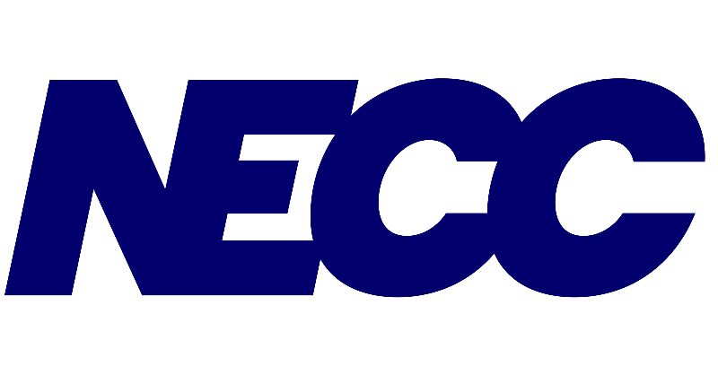

# Guide - Remplacer les logos partenaires

## 📁 Structure des fichiers

1. Créez un dossier `logos` dans votre projet
2. Ajoutez vos images PNG dedans

## 🖼️ Format recommandé des logos

- **Format :** PNG avec fond transparent
- **Dimensions :** 180x80px (ou ratio similaire)
- **Poids :** < 100KB par logo
- **Couleur :** Préférez les logos en noir ou couleur originale

## 📝 Nommage des fichiers

Renommez vos logos comme ceci :
- `necc.png`
- `gozulting.png`
- `mixup.png`
- `bandai-namco.png`
- `adecco.png`
- `gametek.png`
- `saint-fons.png`
- `geekali.png`
- `zqsd.png`
- `gameonly.png`
- `ladose.png`
- `japan-impact.png`
- `bnp-paribas.png`
- `sgn.png`

## 🔄 Remplacement dans index.html

Remplacez chaque ligne comme celle-ci :
```html

```

Par :
```html

```

## 📋 Liste complète des remplacements

1. NECC → `logos/necc.png`
2. Gozulting → `logos/gozulting.png`
3. MixUp → `logos/mixup.png`
4. Bandai Namco → `logos/bandai-namco.png`
5. Adecco Group → `logos/adecco.png`
6. GameTek Lyon → `logos/gametek.png`
7. Mairie Saint Fons → `logos/saint-fons.png`
8. GeekAli Festival → `logos/geekali.png`
9. ZQSD → `logos/zqsd.png`
10. GameOnly → `logos/gameonly.png`
11. LaDose.net → `logos/ladose.png`
12. Japan Impact → `logos/japan-impact.png`
13. BNP Paribas → `logos/bnp-paribas.png`
14. Student Gaming Network → `logos/sgn.png`

⚠️ N'oubliez pas de remplacer DEUX FOIS chaque logo (pour l'effet de boucle infinie) !

## 🎨 Si vous n'avez pas les logos

Vous pouvez :
1. Chercher sur Google "nom-entreprise logo png transparent"
2. Utiliser des sites comme Clearbit Logo API
3. Contacter les entreprises pour leur logo officiel
4. Laisser les placeholders temporairement
